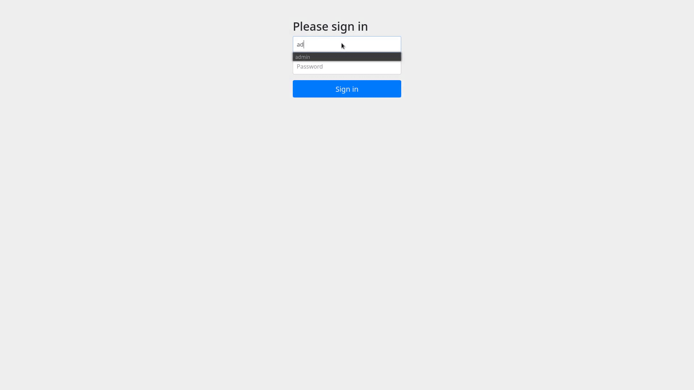

# blog4j

> This project is currently under development.
 
A blogging engine written with Java and Spring Boot.




# How to run
1. Adjust the docker-compose file to your needs.
2. On your server run the following command:

```
$ git clone https://github.com/ahmedelhori/blog4j && cd blog4j && docker-compose build && docker-compose up
```

## Example Config:
### docker-compose
`./docker-compose.yml`
```
version: "3.9"
        ..
        ...
    environment:
      - "BLOG4J_BLOG_HEADER=Example Blog"
      - "BLOG4J_BLOG_FOOTER=\u00a9 Example Blog"
      - "BLOG4J_BLOG_TITLE=Example Blog"
      - "BLOG4J_BLOG_DOMAIN=blog.example.com"
      - "BLOG4J_USERNAME=admin"
      - "BLOG4J_PASSWORD=admin"
      - TZ=Europe/Berlin
        ...
        ..
```

The app will bind to `port 8080` on your machine.
